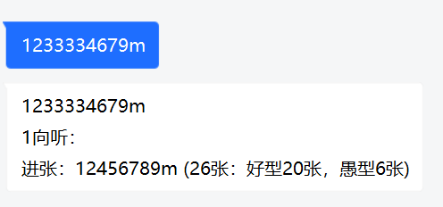
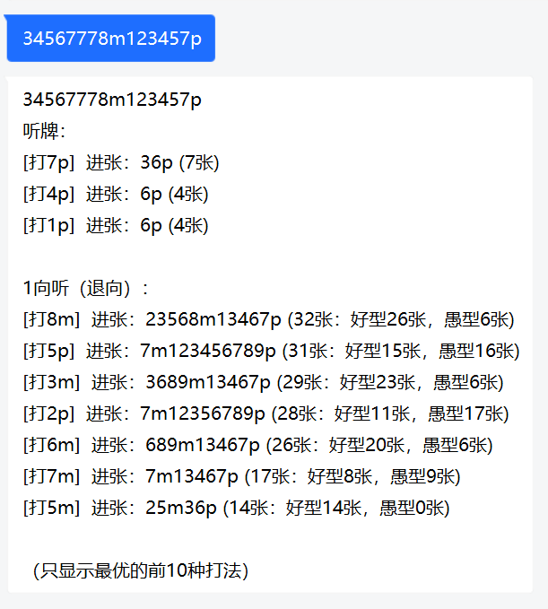
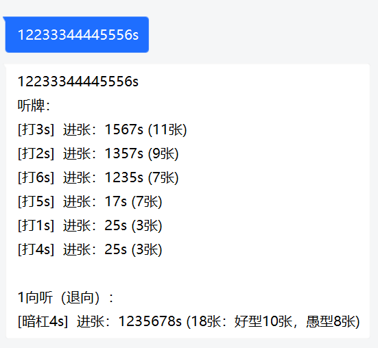
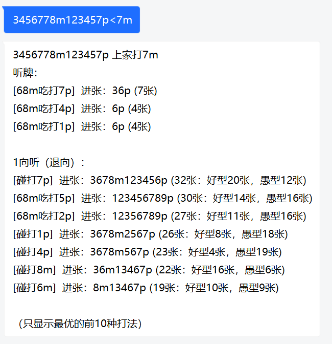
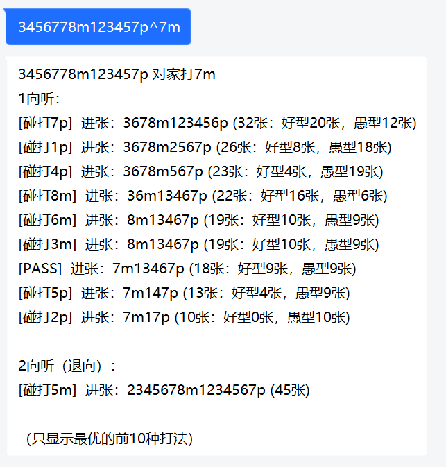
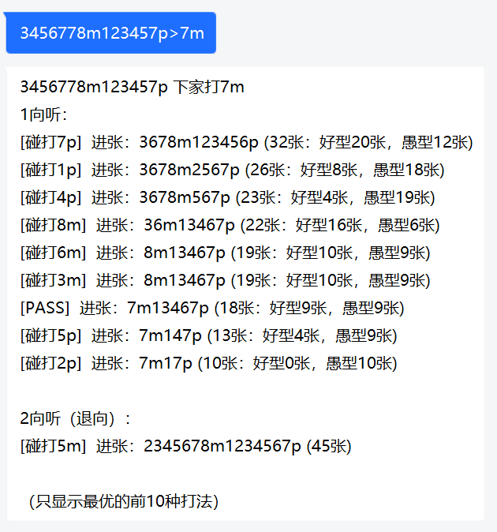
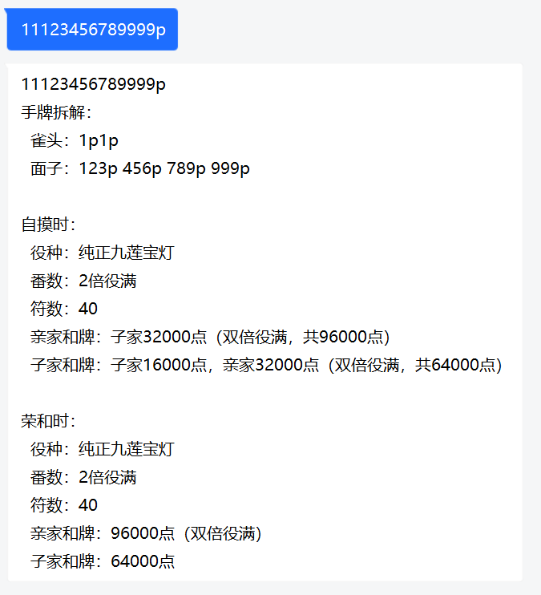
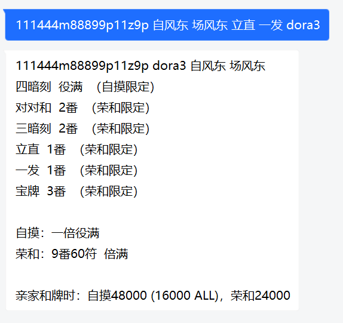
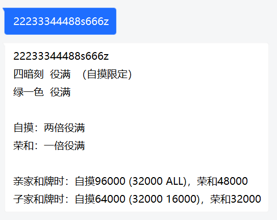
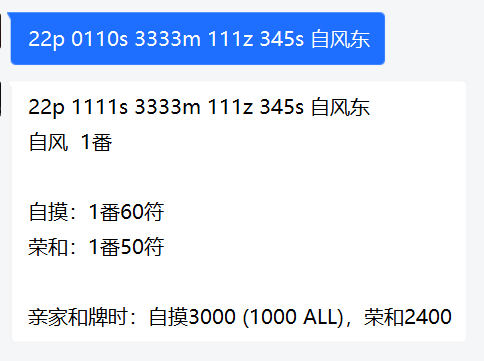

nonebot-plugin-mahjong-utils
========

## 功能

### 手牌分析

- 输入手牌代码，根据输入手牌输出向听数（未摸牌状态）、牌理（已摸牌、未和牌状态）、副露分析（未摸牌状态+他家打出的牌）或和牌分析（已摸牌、已和牌状态）。

#### 向听数分析（未摸牌状态）

输入的手牌为3k+1张时。

计算向听数与进张。一向听的手牌还会计算好型与愚型进张数。

#### 牌理（已摸牌状态）

输入的手牌为3k+2张，且未和牌（向听数大于-1）时。

对每种打法（包括打出与暗杠）计算向听数与进张。一向听的手牌还会计算好型与愚型进张数。

#### 副露分析（未摸牌状态+他家打出的牌）

格式：`手牌代码<上家打出的牌`、`手牌代码^对家打出的牌`或`手牌代码>下家打出的牌`，其中输入的手牌为3k+1张。

对每种打法（包括吃、碰、大明杠与PASS）计算向听数与进张。一向听的手牌还会计算好型与愚型进张数。

#### 和牌分析

输入的手牌为3k+2张，且已和牌（向听数等于-1）时。

手牌代码的最后一张牌作为所和的牌，手牌代码后可通过空格分割输入副露、自风、场风、dora、额外役。暗杠通过0990m的格式输入。

### 番符点数查询

- 输入x番y符，输出亲家/子家的自摸/荣和得点

## Special Thanks

-  [nonebot/nonebot2](https://github.com/nonebot/nonebot2)
-  [ssttkkl/mahjong-utils-py](https://github.com/ssttkkl/mahjong-utils-py) ~~我谢我自己~~

## 在线乞讨

点击请我打两把maimai

## LICENSE

> MIT License
> 
> Copyright (c) 2022 ssttkkl
> 
> Permission is hereby granted, free of charge, to any person obtaining a copy
of this software and associated documentation files (the "Software"), to deal
in the Software without restriction, including without limitation the rights
to use, copy, modify, merge, publish, distribute, sublicense, and/or sell
copies of the Software, and to permit persons to whom the Software is
furnished to do so, subject to the following conditions:
> 
> The above copyright notice and this permission notice shall be included in all
copies or substantial portions of the Software.
> 
> THE SOFTWARE IS PROVIDED "AS IS", WITHOUT WARRANTY OF ANY KIND, EXPRESS OR
IMPLIED, INCLUDING BUT NOT LIMITED TO THE WARRANTIES OF MERCHANTABILITY,
FITNESS FOR A PARTICULAR PURPOSE AND NONINFRINGEMENT. IN NO EVENT SHALL THE
AUTHORS OR COPYRIGHT HOLDERS BE LIABLE FOR ANY CLAIM, DAMAGES OR OTHER
LIABILITY, WHETHER IN AN ACTION OF CONTRACT, TORT OR OTHERWISE, ARISING FROM,
OUT OF OR IN CONNECTION WITH THE SOFTWARE OR THE USE OR OTHER DEALINGS IN THE
SOFTWARE.
